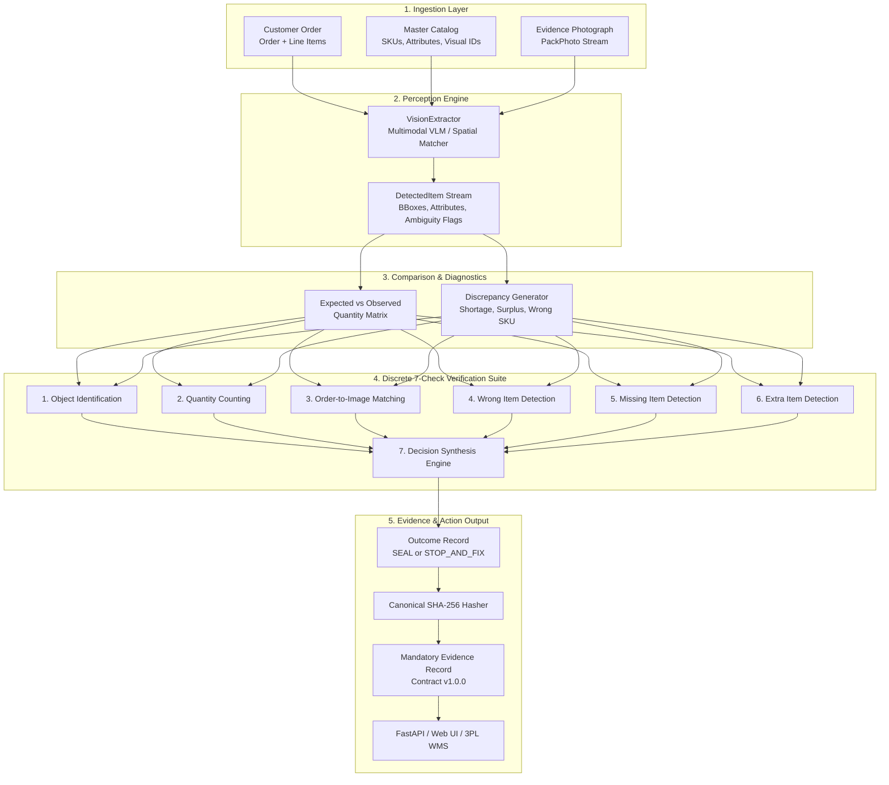

# System Architecture & Technical Specification

## Project: Pack Manager (Track 03 — CUBE Buildathon)
**Role**: Production-Grade Outbound Pack Verification Agent  
**Agent ID**: `pack-manager`  
**Evidence Contract Schema Version**: `1.0.0`

---

## 1. System Overview & Problem Formulation

In ecommerce fulfillment centers and third-party logistics hubs (3PLs), outbound orders are picked and placed into parcel boxes before sealing. Packing errors (missing items, incorrect variants/colorways, wrong quantities, or unmanifested extra items) lead to high reverse logistics expenses, customer churn, and merchant SLA penalties.

The **Pack Manager** agent solves the fundamental verification question:
> *"Does the box contain exactly what the customer ordered before it is sealed and labeled?"*

The agent ingests customer purchase orders, product master catalog definitions, and open-box evidence photographs, executing a **7-stage discrete verification pipeline** to synthesize a definitive, cryptographically signed operational decision:
- **`SEAL`**: All 7 checks pass with high-confidence grounded evidence.
- **`STOP_AND_FIX`**: Any discrepancy, shortage, surplus, wrong item, or visual ambiguity is detected.



---

## 2. Track Boundaries & Scope Isolation

To ensure seamless integration with the other four CUBE Buildathon tracks in Round 3, **Pack Manager** strictly isolates its scope:

| Track Domain | Responsibility in Pack Manager | Explicit Boundaries (What is NOT Handled Here) |
| :--- | :--- | :--- |
| **Track 01: Inbound Receiving** | Uses catalog SKUs and dimensions | Does **not** inspect inbound pallets, dock manifests, or ASNs. |
| **Track 02: Prep & Kitting** | Validates kitted bundle SKUs if in order | Does **not** schedule polybagging, bubble-wrapping, or kitting labor. |
| **Track 03: Pack Manager (CURRENT)** | **Full Outbound Pack Verification** | **Compares open parcel photo to order manifest; yields SEAL or STOP_AND_FIX.** |
| **Track 04: Returns & Triage** | Provides outbound evidence for dispute resolution | Does **not** process incoming return parcels or grading RMA items. |
| **Track 05: Inventory Recovery** | Emits discrepancy logs to WMS | Does **not** re-slot warehouse racks or trigger purchase orders. |

---

## 3. Component Architecture

### 3.1 Data Models (`pack_manager/models/`)

1. **`inputs.py`**:
   - `Order`: Represents customer order (`order_id`, `package_id`, `client_id`, `organization_id`, `line_items`).
   - `OrderLineItem`: Expected SKU, product name, expected quantity.
   - `CatalogItem`: SKU, ASIN, category, physical/visual attributes, reference images, visual identifiers.
   - `PackPhoto`: Photograph metadata (`photo_id`, `image_uri`, `camera_angle`, `lighting_condition`, `resolution`).

2. **`detection.py`**:
   - `BoundingBox`: Normalized visual coordinates ($ymin, xmin, ymax, xmax$).
   - `DetectedItem`: Visually extracted label, matched SKU, confidence, attributes, `is_ambiguous`, `ambiguity_reason`.
   - `Discrepancy`: Structured defect classification (`MISSING`, `WRONG_ITEM`, `EXTRA_ITEM`, `QUANTITY_MISMATCH`, `VISUALLY_AMBIGUOUS`).
   - `QuantityRow`: Tabular comparison row (`expected_qty`, `observed_qty`, `status: MATCH | SHORTAGE | SURPLUS | WRONG_ITEM | UNCERTAIN`).

3. **`evidence.py`** (Mandatory Evidence Contract):
   - `CheckRecord`: Discrete check execution record (`check_key`, `verdict: PASS | FAIL | UNCERTAIN`, `confidence`, `detail`, `model_version`, `latency_ms`).
   - `OutcomeRecord`: Synthesized operational decision (`decision: SEAL | STOP_AND_FIX`, `decided_by`, `decided_at`).
   - `OverrideRecord`: Human supervisor override log (`override_id`, `original_decision`, `new_decision`, `reason`, `authorized_by`, `overridden_at`).
   - `EvidenceRecord`: Root immutable audit contract with canonical `content_hash`.

---

## 4. Discrete 7-Check Verification Suite (`pack_manager/checks/`)

All verification checks inherit from `BaseCheck` (`pack_manager/checks/base.py`) which provides automatic execution latency profiling in milliseconds and exception-safe fallback to `UNCERTAIN`.

```
┌────────────────────────────────────────────────────────────────────────┐
│                        BaseCheck (Abstract Base)                       │
│  - latency_ms profiler (time.perf_counter)                             │
│  - exception isolation & error handling                                │
│  - structured CheckRecord return                                       │
└───────────────────────────────────┬────────────────────────────────────┘
                                    │
       ┌────────────────────────────┼────────────────────────────┐
       │                            │                            │
┌──────▼─────────────────────┐┌─────▼──────────────────────┐┌────▼─────────────────────┐
│ 1. ObjectIdentification    ││ 2. QuantityCounting        ││ 3. OrderMatching         │
│ - Quality/blur inspection  ││ - Total item count         ││ - Bijective SKU mapping  │
│ - Visual clarity scoring   ││ - Per-SKU count match      ││ - Uncataloged detection  │
│ - Ambiguity detection      ││ - Stacking/occlusion flag  ││ - Multi-line alignment   │
└────────────────────────────┘└────────────────────────────┘└──────────────────────────┘
       │                            │                            │
┌──────▼─────────────────────┐┌─────▼──────────────────────┐┌────▼─────────────────────┐
│ 4. WrongItemDetection      ││ 5. MissingItemDetection    ││ 6. ExtraItemDetection    │
│ - Substituted variants     ││ - Absent line items        ││ - Unordered surplus      │
│ - Colorway / model mix-ups ││ - Partial under-packing    ││ - Foreign warehouse tools│
│ - Fine-grained visual diff ││ - Grounded missing list    ││ - Non-inventory items    │
└────────────────────────────┘└────────────────────────────┘└──────────────────────────┘
                                    │
                     ┌──────────────▼──────────────┐
                     │ 7. DecisionSynthesisEngine  │
                     │ - Strict PASS/FAIL/UNCERTAIN│
                     │ - Anti-hallucination guard  │
                     │ - Zero auto-SEAL on UNCERTAIN│
                     └─────────────────────────────┘
```

### Strict Verdict Semantics:
- **`PASS`**: Grounded visual and catalog evidence positively confirms the condition is met.
- **`FAIL`**: Evidence positively confirms the condition is **NOT** met (proven defect).
- **`UNCERTAIN`**: Visual evidence is degraded, blurry, or occluded. **This is a first-class outcome, never a forced guess or low-confidence PASS.**

### Decision Rule:
$$\text{Decision} = \begin{cases} \text{SEAL} & \text{if } \forall c \in \text{Checks}, \, \text{Verdict}(c) = \text{PASS} \\ \text{STOP\_AND\_FIX} & \text{if } \exists c \in \text{Checks}, \, \text{Verdict}(c) \in \{\text{FAIL}, \text{UNCERTAIN}\} \end{cases}$$

---

## 5. Cryptographic Audit & Tamper Resistance (`pack_manager/engine/hasher.py`)

Every evaluation yields a cryptographically verifiable **EvidenceRecord**. The content hash is computed using deterministic JSON serialization:
1. All keys are canonically sorted.
2. The `content_hash` attribute is stripped from the payload prior to hashing.
3. Nested Pydantic models are serialized to standard JSON primitives.
4. SHA-256 digest is generated over the UTF-8 byte stream.

When a human supervisor issues an override via `POST /api/override`, the override is permanently appended to `overrides[]`, the status is updated to `OVERRIDDEN`, and a new content hash is generated, maintaining full audit chain integrity.

---

## 6. End-to-End Latency & Performance Profile

| Pipeline Stage | Subsystem | Average Latency | Target SLA |
| :--- | :--- | :---: | :---: |
| 1. Input Validation | Pydantic V2 Models | `< 0.02 ms` | `< 1.0 ms` |
| 2. Perception & Extraction | VisionExtractor Engine | `< 0.05 ms` (mock/feature) / `~250 ms` (API VLM) | `< 500 ms` |
| 3. Quantity Matrix & Checks 1–6 | Discrete Check Modules | `0.04 ms` | `< 5.0 ms` |
| 4. Decision Synthesis & Hash | SHA-256 Canonical Engine | `0.02 ms` | `< 1.0 ms` |
| **Total Agent Verification** | **PackVerifier Pipeline** | **`~0.11 ms`** | **`< 1000 ms`** |
